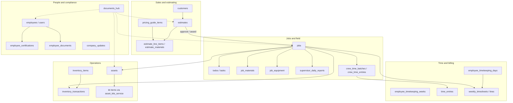

# IPS Operations — Current App Flow (Read-Only Audit)

**Generated:** 2026-05-30  
**Scope:** Code as implemented in `app/main.py`, `app/phase2.py`, `app/navigation.py`, `app/components/sidebar.py`, and `app/pages/*.py` (active modules, not `_legacy/` unless routed).  
**Purpose:** Document how the app works today before further changes. No layout or code recommendations are implemented here.

---

## 1. Application shell

### Entry and runtime

| Step | What happens |
|------|----------------|
| 1 | `app/main.py` runs as the single Streamlit app (`IPS Operations`). |
| 2 | Optional **side routes** (bypass normal nav): inventory scan, asset scan, public weekly-timesheet sign (`?tsign=`), asset QR deeplinks. |
| 3 | **Auth gate:** email/password or phone OTP; optional “remember device”; forced password reset if required. |
| 4 | `apply_pending_navigation()` consumes deferred nav (`ips_nav_pending`). |
| 5 | `ensure_nav_defaults()` — default slug `dashboard`, or `field_dashboard` when `ips_field_mode` is on. |
| 6 | `render_sidebar(active_slug)` — role-filtered nav buttons set `ips_nav_page`. |
| 7 | `render_module(slug)` in `app/phase2.py` — permission check, then the page’s `render()`. |

### Session keys (cross-cutting)

| Key | Role |
|-----|------|
| `ips_nav_page` | Current module slug (`SESSION_NAV_KEY`). |
| `ips_field_mode` | Sidebar toggle → field nav set + default `field_dashboard`. |
| `ips_field_job_id` | Selected job in field workflows. |
| `ips_nav_pending` | Queued navigation label/slug for next run. |
| `_ips_inventory_scan_page` / `_ips_asset_scan_page` | Arms full-page scan UIs. |
| `ips_sel_<module>_*` | Row selection / modal IDs per module. |
| `ips_active_estimate_id` | Active estimate context (materials, builder). |
| Module modal keys | e.g. `selected_asset_id`, `show_asset_detail_modal`, `ips_assets_detail_modal_id`. |

### Module registry

All business pages are registered in `app/phase2.py` → `BUILT_MODULES`. The sidebar uses `app/utils/constants.py` → `NAV_PAGES` (office) and `FIELD_NAV_PAGES` (field).  
**Not in sidebar but routable:** `estimate_materials`, `employee_certifications`, `employee_documents` (reachable via links, permissions, or field nav where listed).

---

## 2. Navigation structure

### Office navigation (`NAV_PAGES`)

Order in sidebar (role-filtered via `app/utils/permissions.py`):

1. Dashboard  
2. Jobs  
3. Job Costing  
4. Customers  
5. Estimates  
6. **Estimating group:** Pricing Guide  
7. Inventory  
8. Assets  
9. Timekeeping  
10. Weekly Timesheets  
11. Users (`employees` slug)  
12. Company Updates  
13. Tasks  
14. Documents  
15. Reports  
16. Admin  
17. Settings  

Sidebar also: **Field Supervisor Mode** toggle, user block, Log out.

### Field navigation (`FIELD_NAV_PAGES`)

When `ips_field_mode` is true:

- Field Home → `field_dashboard`  
- Today's Work → `field_day`  
- My Jobs → `jobs` (field context)  
- Daily Report → `field_daily_reports`  
- Crew Time → `field_crew_time`  
- Scan Stock → `scan_inventory` (session flag, not a `BUILT_MODULES` slug)  
- Scan Asset → `scan_asset` (session flag)  
- Today's Tasks → `tasks`  
- Log Time → `timekeeping`  
- Assets / Inventory / Certifications → respective modules  

### Role access (summary)

| Role | Notable restrictions |
|------|----------------------|
| Admin | All office + field slugs. |
| Supervisor / Project Manager | No `admin`; has field + weekly timesheets + costing. |
| Employee | Dashboard, jobs, timekeeping, company updates, tasks, documents, field dashboard/day, coupling inspection, settings; **no** customers, estimates, inventory office CRUD, weekly timesheets management, etc. |
| Viewer | Dashboard, company updates, reports, settings only. |

### Auxiliary routes (not sidebar slugs)

| Route | Trigger | Page |
|-------|---------|------|
| Inventory scan | `scan_inventory` nav or query capture | `app/pages/inventory_scan.py` |
| Asset scan | `scan_asset` nav or query capture | `app/pages/asset_scan.py` |
| Timesheet sign | `?tsign=<token>` | `app/pages/sign_timesheet.py` (public) |
| Asset QR | Query / `apply_asset_deeplink_navigation()` | Opens **Assets** with modal |

---

## 3. Data relationships (high level)

---

## 4. Status flows (reference)

| Domain | Values used in UI (may differ from `app/utils/constants.py`) |
|--------|----------------------------------------------------------------|
| Jobs | Draft, Planning, Scheduled, Active, Awarded, On Hold, Completed, Closed, Cancelled, Archived, Deleted, Estimate Pending; daily updates: Draft, Open, Submitted, Closed. |
| Estimates | Draft, Pending, Sent, Approved, Awarded, Rejected, Expired, Cancelled. |
| Tasks | Open/Closed in UI; DB may map to Open, In Progress, Blocked, Done, Cancelled. |
| Timekeeping | Draft, Pending, Approved, Rejected (week + day + line). |
| Weekly timesheets | Generated, Sent, Approved, Signed, Voided. |
| Inventory | In Stock, Low Stock, Out of Stock, On Order, Discontinued. |
| Assets (page) | Available, In Service, Assigned, Out for Repair, Maintenance Due, Retired, Sold, Lost. |
| Customers | Active, Inactive, Prospect, On Hold. |
| Company updates | Draft, Published, Scheduled, Archived. |
| Crew time batches | draft, submitted, approved. |
| Coupling inspections | draft, complete, exported. |
| Employees | Active, Inactive, Deleted, Locked, Pending. |

---

## 5. Shared UI patterns

Most list modules follow the same pattern:

1. Page header + filter bar (`layout_filter_bar`).  
2. Paginated custom table (`render_table_pagination_*`, column filters).  
3. Row click or checkbox → **detail modal** with tabs.  
4. `open_record_modal` / `build_modal_cache` for Supabase-backed records.  
5. Demo IDs (`demo-*`) often persist to **session overrides** only.  
6. **Export** buttons appear on many pages but are often **not wired** to downloads.

Field modules add: `render_field_job_bar`, `ips_field_job_id`, and embed the same services inside **Today's Work** (`field_day`).

---

## 6. Module documentation

---

### Dashboard

**Page name:** Dashboard (`dashboard`)

**Purpose:** Office landing page with KPI-style summaries, charts, recent jobs, and quick navigation shortcuts.

**Main data/table(s):** `load_dashboard_kpis()` (counts from `estimates`, jobs); most charts use **demo** helpers (`demo_sales_series`, `demo_activities`, `demo_deadlines`, `demo_recent_jobs`).

**Primary actions:** Period date range; Customize (UI only); quick-action buttons to other modules.

**Buttons/forms available:** Period picker; quick links (Jobs, Estimates, Reports, Timekeeping, Inventory, Assets, Documents).

**Tabs/sections:** KPI grid; Sales Overview / Sales by Category / Recent Activity; Job Status / Aging Invoices / Upcoming Deadlines; Recent Jobs table; Quick Actions.

**Status values used:** Job status labels on recent jobs (from demo/real rows).

**Records created:** None.

**Records updated:** None.

**Records deleted/archived:** None.

**Links to other modules:** `render_dashboard_quick_actions` → jobs, estimates, reports, timekeeping, inventory, assets, documents.

**Known dependencies:** `app/pages/dashboard.py`, `_core/_data` demo loaders.

**Current confusing points:** Dollar KPIs and several panels are hardcoded demo values; not a live financial dashboard.

---

### Jobs

**Page name:** Jobs (`jobs`)

**Purpose:** Central job database — create and manage jobs, assignments, documents, daily updates, equipment, subjobs, weekly timesheets, and field workflows.

**Main data/table(s):** `jobs`; related: `estimates`, `job_equipment`, job documents, `inventory_transactions`, photos, `supervisor_daily_reports`, `weekly_timesheets`, `todos`/`tasks`.

**Primary actions:** New Job; open Job Details modal; Complete/Cancel/Archive; daily updates; document upload; launch coupling inspection; field job bar.

**Buttons/forms available:** + New Job expander; Save/Cancel; Export (no download); modal Edit; action buttons per status; IPS Forms / coupling launcher.

**Tabs/sections:**  
- **Office list:** filters + table.  
- **Modal:** Overview, Scope, Estimates, Inventory, Equipment, Schedule, Subjobs, IPS Forms, Weekly Timesheets, Documents, Photos, Daily Updates, Notes.  
- **Field:** Overview, Subjobs, Photos, Daily Report (subset).

**Status values used:** See §4; view filters: Active, All, Completed, Cancelled, Deleted/Archived.

**Records created:** `persist_job()`; daily updates; documents; coupling inspection session.

**Records updated:** Modal edit; job actions; daily update submit.

**Records deleted/archived:** Job archive/delete actions via `render_job_action_buttons`.

**Links to other modules:** Estimates tab; `jc_focus_job_id` → Job Costing; `open_job_detail` / `ips_field_job_id`; tasks/subjobs; timekeeping; weekly timesheets; coupling_inspection.

**Known dependencies:** `jobs_service`, `job_documents`, `asset_kits_service`, field helpers.

**Current confusing points:** “Subjobs” tab variable is `tab_tasks`; Export not implemented; office vs field show different tabs; estimate_materials not linked from here directly.

---

### Job Costing

**Page name:** Job Costing (`job_costing`)

**Purpose:** Per-job cost view — labor (read-only), materials, equipment, variance vs estimate.

**Main data/table(s):** `jobs`, `estimates`, `time_entries`, `job_materials`, `job_equipment`, `employees`, `customer_locations`.

**Primary actions:** Select job; add material line; add equipment line.

**Buttons/forms available:** Job selector; Add material form; Add equipment form.

**Tabs/sections:** Summary metrics; Labor; Materials; Equipment; Totals & variance.

**Status values used:** None on costing rows (inherits job/estimate context).

**Records created:** `job_materials`, `job_equipment` (admin/PM).

**Records updated:** Via insert forms only (no inline edit/delete in UI).

**Records deleted/archived:** Not exposed in UI.

**Links to other modules:** `jc_focus_job_id` from Jobs; estimate totals for variance.

**Known dependencies:** `job_costing` page + admin insert helpers.

**Current confusing points:** Labor is read-only; equipment “basis” stuffed in `notes`; delete messaging points users back to Jobs.

---

### Customers

**Page name:** Customers (`customers`)

**Purpose:** Customer companies with locations, contacts, and linked jobs/estimates.

**Main data/table(s):** `customers`, `customer_locations`, `customer_contacts`.

**Primary actions:** New customer; open customer modal; nested location/contact CRUD.

**Buttons/forms available:** + New Customer; Save/Cancel; modal tabs; nested + Location / + Contact.

**Tabs/sections:** List + filters; modal: Overview, Locations, Contacts, Jobs, Estimates, Documents, Notes, Activity.

**Status values used:** Active, Inactive, Prospect, On Hold; location: Active, Inactive, On Hold.

**Records created:** `create_customer`, `create_customer_location`, `create_customer_contact`.

**Records updated:** `persist_customer` and nested updates.

**Records deleted/archived:** Service-layer removes where implemented in modals.

**Links to other modules:** Jobs and Estimates pickers use `customer_id`; jobs/estimates tabs inside modal.

**Known dependencies:** `customers_service`.

**Current confusing points:** “Open jobs” counts use local closed-status sets that may not match Jobs page filters; legacy address fields on create form.

---

### Estimates

**Page name:** Estimates (`estimates`)

**Purpose:** Build, price, and manage customer proposals; approve into jobs.

**Main data/table(s):** `estimates`, `estimate_line_items` (cost builder), attachments metadata.

**Primary actions:** New Estimate; open detail modal; Build Estimate; Approve Job; estimate actions (approve/delete).

**Buttons/forms available:** Export CSV (two-step); + New Estimate dialog; Edit; modal tab saves.

**Tabs/sections:** List (filtered); modal: Overview, Scope of Work, Cost Builder, Markups, Summary, Proposal Preview, Attachments, Notes, Activity.

**Status values used:** Draft, Pending, Sent, Approved, Awarded, Rejected, Expired, Cancelled.

**Records created:** `persist_estimate()`; line items via builder.

**Records updated:** Partial saves per tab; markups/scope.

**Records deleted/archived:** Delete estimate action.

**Links to other modules:** `ips_active_estimate_id`; approve → job; Pricing Guide options in builder; estimate_materials via separate slug (not sidebar).

**Known dependencies:** `estimates_service`, `estimate_builder_ui`.

**Current confusing points:** List hardcoded to “Active Estimates” (no view toggle in UI); Attachments/Activity placeholders; Export needs two clicks.

---

### Pricing Guide

**Page name:** Pricing Guide (`pricing_guide`)

**Purpose:** Master catalog for estimating — items, pricing, links to inventory/assets/vendors.

**Main data/table(s):** `pricing_guide_items` (fallback `estimate_materials`); `vendors`; reads `inventory_items`, `assets`.

**Primary actions:** New item; CSV import; row → detail modal; pricing actions.

**Buttons/forms available:** + New Pricing Item; import block; modal edit/save.

**Tabs/sections:** Summary cards; import; add form; table; modal: Overview, Pricing, Links, Price History, Notes.

**Status values used:** Row `status` / `include_inactive` filtering.

**Records created:** Via `pricing_guide_service`.

**Records updated:** Modal edit.

**Records deleted/archived:** Service delete where exposed in action buttons.

**Links to other modules:** Estimates cost builder; inventory/asset IDs on Links tab.

**Known dependencies:** `pricing_guide_service`, `cached_pricing_guide_rows`.

**Current confusing points:** Table may fall back to `estimate_materials`; asset rows depend on `include_in_pricing_guide`.

---

### Estimate Materials

**Page name:** Estimate Materials (`estimate_materials`) — **not in office sidebar**

**Purpose:** Line-level materials view for one selected estimate.

**Main data/table(s):** `estimates`, `estimate_materials` / `estimate_line_items`.

**Primary actions:** Pick estimate; add material; open material modal.

**Buttons/forms available:** Back to Estimates; + Add Material; Save line; Export / Edit Estimate / Add from Inventory (stubs).

**Tabs/sections:** Estimate summary; Materials | Add Items | Summary; material modal tabs.

**Status values used:** Estimate status on summary card.

**Records created:** `persist_estimate_material()`.

**Records updated:** Modal save.

**Records deleted/archived:** Not clearly exposed.

**Links to other modules:** `ACTIVE_ESTIMATE_KEY`; `SESSION_NAV_KEY` → estimates on back.

**Known dependencies:** `estimate_materials` page.

**Current confusing points:** Several buttons have no handlers; freight/tax/markup are hardcoded percentages in UI.

---

### Inventory

**Page name:** Inventory (`inventory`)

**Purpose:** Stock items, levels, transactions, and field scanning.

**Main data/table(s):** `inventory_items`, `inventory_transactions`; storage for images.

**Primary actions:** New item; row → detail modal; field Scan Stock.

**Buttons/forms available:** Export (stub); + New Item; Save; modal tabs; scan bar in field mode.

**Tabs/sections:** List + stock view filter; New Item expander; modal: Overview, Stock History, Transactions, Purchase Orders, Vendors, Notes, Attachments.

**Status values used:** In Stock, Low Stock, Out of Stock, On Order, Discontinued.

**Records created:** `save_inventory_item()`; transactions via service.

**Records updated:** Modal edit.

**Records deleted/archived:** Per service/modal rules.

**Links to other modules:** `scan_inventory` full page; pricing guide; job inventory tab; `record_inventory_transaction` (newer path) vs legacy scan updates.

**Known dependencies:** `inventory_service`, `inventory_scan.py`.

**Current confusing points:** Export not wired; scan slug not in `BUILT_MODULES` but routed in `main.py`; two code paths for stock movement (service vs legacy scan).

---

### Assets

**Page name:** Assets (`assets`)

**Purpose:** Equipment and small tools; kits; maintenance; assignments; QR deeplinks.

**Main data/table(s):** `assets`; `asset_inspections`, `asset_issues`; kit items via `asset_kits_service`; `documents_hub`.

**Primary actions:** New asset; row checkbox → detail modal; Equipment vs Small Tools tabs; kit summary; Scan Asset.

**Buttons/forms available:** Export (stub); + New Asset; Load kit summary; modal Edit; field scan.

**Tabs/sections:** **Equipment** list (checkbox selection like office jobs table); **Small Tools** list (checkbox, grid-aligned); modal: Overview, Kit/Contents, Maintenance, Documents, Assignments, Depreciation, Notes, Activity.

**Status values used:** Page normalizer: Available, In Service, Assigned, Out for Repair, Maintenance Due, Retired, Sold, Lost (differs from `ASSET_STATUSES` constant).

**Records created:** `save_asset()`; inspections/issues inserts.

**Records updated:** Modal update; retire flows.

**Records deleted/archived:** Retire via service.

**Links to other modules:** QR deeplink; pricing guide; jobs equipment tab; coupling inspection from equipment; small tools open same asset modal.

**Known dependencies:** `assets_service`, `asset_kits_ui`, `asset_detail.py` patterns.

**Current confusing points:** Two status enum sources; Equipment vs Small Tools duplicate UX; Inventory Action vs Item Form not separated in product terms (noted for future architecture only).

---

### Timekeeping

**Page name:** Timekeeping (`timekeeping`)

**Purpose:** Weekly employee timecards — daily hours in list row, allocation to jobs/shop/admin, approval workflow.

**Main data/table(s):** `employee_timekeeping_weeks`, `employee_timekeeping_days`, allocation lines; ties to `time_entries` on persist.

**Primary actions:** Week navigation; expand row; edit daily hours; allocate per day; submit/approve/reject (day, week, line); open Weekly Timesheets.

**Buttons/forms available:** Previous/Current/Next week; Save allocations; Submit all; Approval panel; per-line Submit/Approve/Reject; + Add assignment.

**Tabs/sections:** List view with expandable **daily allocation** panel per employee (`app/components/timekeeping_allocation.py`): day summary, header row, control rows (Assignment, Type, Hours, Remaining, Status, Notes, Actions). Modal: Weekly Timecard, Daily Entries, Approval, Notes, Activity. Field: horizontal week grid.

**Status values used:** Draft, Pending, Approved, Rejected.

**Records created:** Allocation lines; timecard rows on save.

**Records updated:** Daily hours; allocation lines; status transitions.

**Records deleted/archived:** Remove assignment row (multi-line days).

**Links to other modules:** `ips_nav_page` → weekly_timesheets; jobs for assignment options; embedded in `field_day` Time tab.

**Known dependencies:** `timekeeping.py`, `timekeeping_allocation.py`, timekeeping CSS in `styles.py`.

**Current confusing points:** Export stub; dual week vs day approval; field users see filtered summaries; expanded allocation layout sensitive to CSS init order (`tk_alloc_day`).

---

### Weekly Timesheets

**Page name:** Weekly Timesheets (`weekly_timesheets`)

**Purpose:** Customer-facing weekly job timesheets built from timekeeping, expenses, notes; PDF/Excel; signature flow.

**Main data/table(s):** `weekly_timesheets`, `weekly_timesheet_lines`; reads timekeeping hours, job data.

**Primary actions:** Select job/week; generate; send; approve; void; export; public sign link.

**Buttons/forms available:** Inside `render_weekly_timesheet_builder` (role-gated).

**Tabs/sections:** Single builder UI (no page-level tabs).

**Status values used:** Generated, Sent, Approved, Signed, Voided.

**Records created:** Timesheet + lines.

**Records updated:** Edits until locked statuses.

**Records deleted/archived:** Void.

**Links to other modules:** Jobs tab; Timekeeping link; `wjt_prefill_job_id`; public `sign_timesheet` route.

**Known dependencies:** `weekly_timesheet_service`, `weekly_job_timesheet_service`, `can_manage_weekly_timesheets`.

**Current confusing points:** Entire UX in one component; employees cannot manage (role gate).

---

### Users (Employees)

**Page name:** Users (`employees` slug, label “Users”)

**Purpose:** System users / employees — roles, departments, assignments, certs/docs/time history.

**Main data/table(s):** `employees` / auth users; `ensure_core_employee_seed()` on first load.

**Primary actions:** New user; invite email; modal edit.

**Buttons/forms available:** Export (stub); + New User; Save User; modal tabs.

**Tabs/sections:** List; New User expander; modal: Overview, Role & Permissions, Departments, Assigned Jobs, Certifications, Documents, Time History, Notes, Activity Log.

**Status values used:** Active, Inactive, Deleted, Locked, Pending.

**Records created:** `persist_employee()`; invite flow.

**Records updated:** Modal save.

**Records deleted/archived:** Status transitions via edit.

**Links to other modules:** Certifications/Documents modules filter by `ACTIVE_EMPLOYEE_KEY`; timekeeping rows per employee.

**Known dependencies:** `employees` page, auth integration.

**Current confusing points:** Nav says “Users”, slug is `employees`; demo seed once per session.

---

### Company Updates

**Page name:** Company Updates (`company_updates`)

**Purpose:** Internal announcements, safety, events, HR/project news.

**Main data/table(s):** `company_updates`; optional `company_events`.

**Primary actions:** New update; publish; modal view/edit.

**Buttons/forms available:** + New Update; Publish; row → modal; edit/remove.

**Tabs/sections:** Feed list; sort/search; new update form; modal view tabs.

**Status values used:** Draft, Published, Scheduled, Archived.

**Records created:** `persist_company_update()`.

**Records updated:** Modal edit.

**Records deleted/archived:** Remove/archive in modal flows.

**Links to other modules:** Documents hub module link type “Company Updates”.

**Known dependencies:** `company_updates.py`, UI components.

**Current confusing points:** Category/audience enums are page-local, not only constants.

---

### Tasks / Subjobs

**Page name:** Tasks (`tasks`)

**Purpose:** To-dos and job subjobs — assignments, priorities, job/estimate links.

**Main data/table(s):** `todos` (alt `tasks`); `load_jobs()` for context.

**Primary actions:** New task; open modal; field “Due Today” view; delete subjob from job context.

**Buttons/forms available:** + New Task; Create Task; view selector (Open/Closed/All, Due Today in field).

**Tabs/sections:** Table; modal: Overview, Linked Records, Assignment, Notes, Activity. Field: due-today panel per job. Jobs modal **Subjobs** tab reuses task renderer.

**Status values used:** Open, Closed (UI); DB may use In Progress, Blocked, Done, Cancelled. Priorities: High, Medium, Low.

**Records created:** `persist_task()`.

**Records updated:** `_save_task_field()`; session overrides for demo IDs.

**Records deleted/archived:** `delete_job_subjob()`.

**Links to other modules:** `field_day` Tasks tab; `ips_task_form_job_id` prefill; jobs Subjobs tab.

**Known dependencies:** `tasks.py`, job task integration.

**Current confusing points:** Demo tasks may never hit Supabase; field default view differs from office.

---

### Documents

**Page name:** Documents (`documents`)

**Purpose:** Central document hub with links to jobs, estimates, assets, employees, inventory, updates, certifications.

**Main data/table(s):** `documents_hub` (alt `documents`).

**Primary actions:** Upload; row → modal; edit linkage and metadata.

**Buttons/forms available:** + Upload Document; Save; modal edit.

**Tabs/sections:** Search; filters; table; detail modal.

**Status values used:** `doc_type` from lookups; Public/Restricted access.

**Records created:** `persist_document()` on upload.

**Records updated:** Modal edit.

**Records deleted/archived:** Service delete.

**Links to other modules:** `linked_module` + `linked_ref` per `DOCUMENT_LINK_MODULES`.

**Known dependencies:** `documents.py`, HR permission filter.

**Link model (when to use which module):**
- **Documents hub** (`documents`) — operational files linked to jobs, estimates, assets, inventory, company updates, or certifications via `linked_module` + `linked_ref`. Use for project/customer deliverables and cross-module attachments.
- **Employee Documents** (`employee_documents`) — HR/compliance files tied to a specific employee record (licenses, medical, training). Stored in `employee-documents` bucket; not shown in the hub unless also uploaded there separately.

**Current confusing points:** Both modules can store PDFs; only Employee Documents is employee-scoped. Prefer the hub for job/estimate/asset links; use Employee Documents for workforce compliance.

---

### Reports

**Page name:** Reports (`reports`)

**Purpose:** Operational report sections with CSV export.

**Main data/table(s):** **Demo only** — `demo_report_*` from `_core/_data`.

**Primary actions:** Export CSV per section.

**Buttons/forms available:** Tab-like sections: Financial | Labor & Time | Inventory & Assets | Compliance; each with Export CSV.

**Tabs/sections:** Four report categories with sub-blocks.

**Status values used:** Display-only pills from demo rows.

**Records created:** None.

**Records updated:** None.

**Records deleted/archived:** None.

**Links to other modules:** Dashboard quick actions (“New Invoice”, “New PO”) point here.

**Known dependencies:** Demo data helpers only.

**Current confusing points:** Presents as live ops reporting but data is sample/demo throughout.

---

### Admin

**Page name:** Admin (`admin`)

**Purpose:** Lookup tables (dropdown sources) and application settings UI.

**Main data/table(s):** `ips_lookup_*` tables via `lookup_service`; settings in **session only**.

**Primary actions:** Add/edit/remove lookup values; Save settings (session).

**Buttons/forms available:** Lookup Tables | Application Settings tabs; row modals for lookups.

**Tabs/sections:** Lookup Tables first when opened as Admin; Settings tab with toggles (theme disabled).

**Status values used:** N/A (free-text lookup values).

**Records created:** Lookup rows persisted to Supabase.

**Records updated:** Lookup edit.

**Records deleted/archived:** Lookup remove.

**Links to other modules:** All modules using `lookup_options()` / constants fallback.

**Known dependencies:** `admin.py`, `LOOKUP_TABLES` constant.

**Current confusing points:** Application Settings do not persist to DB; duplicate nav entry with Settings.

---

### Settings

**Page name:** Settings (`settings`)

**Purpose:** Same render as Admin with **Settings tab first** and caption pointing lookups to Admin.

**Main data/table(s):** Identical to Admin.

**Primary actions:** Save settings (session); manage lookups in second tab.

**Buttons/forms available:** Same as Admin (tab order reversed).

**Tabs/sections:** Application Settings | Lookup Tables.

**Status values used:** N/A.

**Records created/updated/deleted:** Same as Admin.

**Links to other modules:** `nav_slug()` switches default tab and titles.

**Known dependencies:** `settings.py` → `admin.render`.

**Current confusing points:** Two nav items, one implementation; settings not durable.

---

## 7. Field modules (summary)

| Slug | Purpose | Main tables | Key link |
|------|---------|-------------|----------|
| `field_dashboard` | Supervisor home — KPIs, missing reports, quick nav | jobs, `supervisor_daily_reports`, `time_entries` | → `field_day`, scan slugs |
| `field_day` | Hub: Report \| Crew \| Time \| Tasks for one job | Delegates to four modules | `ips_field_job_id` |
| `field_daily_reports` | Daily report wizard (crew, photos, safety) | `supervisor_daily_reports` + children | Same as field_day Report tab |
| `field_crew_time` | Batch crew hours ST/OT/DT | `crew_time_batches`, `crew_time_entries` | Approves → `time_entries` |
| `coupling_inspection` | Torque/inspection form + PDF | `coupling_inspections` + children | Requires launch from Jobs (session keys) |

**Employee-facing field pages** (certifications, documents): `employee_certifications`, `employee_documents` — in permissions for field roles where applicable; certifications in `FIELD_NAV_PAGES`.

---

### Employee Certifications

**Page name:** Employee Certifications (`employee_certifications`)

**Purpose:** Credential tracking, expirations, attachments.

**Main data/table(s):** `employee_certifications`, `employees`.

**Primary actions:** + Add Certification; upload; filter by employee.

**Buttons/forms available:** Alert banner; filters; modal edit.

**Tabs/sections:** List; add dialog; detail modal.

**Status values used:** Active, Expiring Soon, Expired, Missing, Not Required.

**Records created/updated:** `persist_certification()`; upload after save.

**Records deleted/archived:** Per modal/service.

**Links to other modules:** `ACTIVE_EMPLOYEE_KEY`; field nav.

**Known dependencies:** `employee_certifications.py`, alert service.

**Current confusing points:** Upload requires saved Supabase row first.

---

### Employee Documents

**Page name:** Employee Documents (`employee_documents`)

**Purpose:** Per-employee HR/training file storage (separate from Documents hub).

**Main data/table(s):** `employee_documents`, `employees`.

**Primary actions:** Upload; row → detail.

**Buttons/forms available:** Employee picker; type filter; + Upload Document.

**Tabs/sections:** Table; upload expander; detail modal.

**Status values used:** `DOCUMENT_TYPES`; Public/Restricted.

**Records created:** Upload path shows **demo success** — `persist_employee_document()` not wired in main render path.

**Records updated:** Modal where implemented.

**Records deleted/archived:** Service layer exists; UI may be limited.

**Links to other modules:** `ACTIVE_EMPLOYEE_KEY`; HR visibility rules.

**Known dependencies:** `employee_documents.py`.

**Current confusing points:** Save upload is explicitly demo; overlaps with Documents hub.

---

## 8. Inventory ↔ asset action note (audit only)

Per product direction (not implemented in this doc):

- **Inventory Action** (stock movement) belongs in `inventory_service.record_inventory_transaction()`.
- **Item Form** (checklist/inspection attached to an action) is a separate concept; `app/components/inventory_actions.py` today is **admin** deactivate/delete, not stock movement.
- Legacy `inventory_scan.py` still has paths that bypass the service layer.

---

## 9. Consolidated confusing / incomplete flows

| Area | Issue |
|------|--------|
| Export buttons | Common on Dashboard, Jobs, Inventory, Assets, Timekeeping, Users — often no file generation. |
| Demo vs live | Dashboard, Reports, parts of Tasks/Employees/Documents use demo or session-only data. |
| Dual nav to same page | Admin + Settings; Users label vs `employees` slug. |
| Scan routes | `scan_inventory` / `scan_asset` not in `BUILT_MODULES` but work via `main.py` session flags. |
| Estimate list | View filter fixed to Active in code. |
| Estimate Materials | Not in sidebar; several action buttons unwired. |
| Job ↔ Tasks naming | “Subjobs” tab vs Tasks module. |
| Timekeeping allocation | Complex CSS + Streamlit columns; sensitive to style variable init order. |
| Weekly timesheets | Role-gated; separate public sign URL. |
| Coupling inspection | Unusable from empty nav — needs Jobs launch context. |
| Field duplication | `field_daily_reports` vs `field_day` Report tab. |
| Status enums | Jobs, assets, constants.py often disagree on labels. |
| Inventory transactions | Service vs legacy scan divergence. |

---

## 10. Typical end-to-end workflows (as implemented)

### A. Estimate → Job → Costing

1. Create customer (Customers).  
2. Create estimate (Estimates) → Cost Builder uses Pricing Guide.  
3. Approve / award estimate → creates or links **Job**.  
4. Track costs on **Job Costing** (materials/equipment manual entry; labor from `time_entries`).  

### B. Field week

1. Supervisor enables **Field Supervisor Mode**.  
2. **Field Home** → pick job → **Today's Work** (`field_day`).  
3. Submit **Daily Report**, **Crew Time** batch, **Time** (timekeeping grid), **Tasks**.  
4. Crew time **approved** → syncs to `time_entries`.  

### C. Office time → customer timesheet

1. **Timekeeping** — enter week hours per employee, expand row, allocate days to jobs (S/T, O/T).  
2. Submit/approve timecards.  
3. **Weekly Timesheets** — generate per job, send, approve, optional customer sign (`tsign`).  

### D. Inventory / assets

1. **Inventory** — maintain `inventory_items`; field **Scan Stock** for checkout/check-in style flows.  
2. **Assets** — equipment + small tools; checkbox opens modal; kits via Kit/Contents tab.  
3. Job modal tabs pull inventory/equipment into job context.  

---

## 11. File index (where to read code)

| Concern | Primary files |
|---------|----------------|
| App entry | `app/main.py` |
| Routing | `app/phase2.py`, `app/navigation.py` |
| Sidebar | `app/components/sidebar.py`, `app/utils/constants.py` |
| Permissions | `app/utils/permissions.py` |
| Page modules | `app/pages/<module>.py` |
| Timekeeping allocation UI | `app/components/timekeeping_allocation.py` |
| Services / DB | `app/services/*`, `app/pages/_core/_data.py` |
| Styles (module CSS) | `app/styles.py` (`inject_*_module_css`) |

---

## 12. Data-flow repair tracking (follow-up)

After this as-built audit, tracked repair artifacts live here (documentation only; no code changes until approved):

| Document | Purpose |
|----------|---------|
| [`KNOWN_DATA_BUGS.md`](KNOWN_DATA_BUGS.md) | Registry of broken links, state bugs, and pollution risks (IDs: DL, NP, XP, SP, SV, SS, CD, OR, PP) |
| [`FIX_ORDER.md`](FIX_ORDER.md) | Phased fix sequence (Phases 0–7) before layout/CSS work |
| [`DATA_FLOW_REPAIR_PLAN.md`](DATA_FLOW_REPAIR_PLAN.md) | Strategy, acceptance tests, approval gates, workstreams |

---

*This document is descriptive only. It does not change application behavior.*
