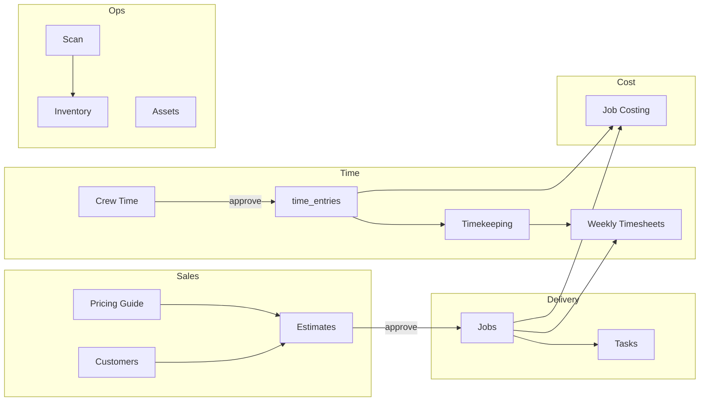

# Data Flow Repair Plan

**Status:** Planning / triage only — **no application code changes** until explicitly approved.  
**Baseline:** [`CURRENT_APP_FLOW.md`](CURRENT_APP_FLOW.md) (as-built behavior)  
**Bug registry:** [`KNOWN_DATA_BUGS.md`](KNOWN_DATA_BUGS.md)  
**Execution order:** [`FIX_ORDER.md`](FIX_ORDER.md)

---

## 1. Objective

Make the **current** IPS Operations app flow **reliable at the data layer** so that:

1. Records users create, edit, or approve are stored in the intended Supabase tables.
2. Cross-module navigation carries the correct record IDs and week/job context.
3. Status filters and summary counts reflect the same rules as list pages.
4. Demo, session-only, and legacy bypass paths are either removed, gated, or clearly labeled—not mistaken for production truth.

**Non-goals (this plan):**
- Layout cleanup, CSS, or Streamlit column refactors.
- New features or module redesign.
- Inventory “Item Form” vs “Inventory Action” product split (noted for later; see CURRENT_APP_FLOW §8).

---

## 2. Principles

| # | Principle |
|---|-----------|
| P1 | **One write path per entity action** — e.g. all stock movement → `record_inventory_transaction()`. |
| P2 | **Canonical status per entity** — one normalizer used for list filter, modal display, DB write, and cross-module counts. |
| P3 | **Explicit handoff keys** — document and set session keys at navigation boundaries (`ACTIVE_ESTIMATE_KEY`, `jc_focus_job_id`, `wjt_prefill_job_id`, coupling launcher). |
| P4 | **Fail loud in production** — missing tables (e.g. `pricing_guide_items`) should error or banner, not silently fall back to legacy tables. |
| P5 | **Demo is opt-in** — demo IDs, demo reports, and seed employees must not mix undetectably with live rows. |
| P6 | **Minimal UI change** — only wire existing buttons to existing services or disable actions until wired. |

---

## 3. Current flow (target chains to protect)

These end-to-end chains are the **acceptance backbone**. Repair work should unblock them in order (see FIX_ORDER).

### Chain A — Estimate → Job → Cost
`Customers` → `Estimates` (cost builder ← `pricing_guide_items`) → approve → `jobs` → `job_costing` (labor ← `time_entries`, materials/equipment tables).

**Blocking bugs:** XP-002, OR-001, SP-005, SV-001, XP-001, DL-004, SP-002.

### Chain B — Field week → payroll hours
`field_day` → daily report + `field_crew_time` → approve → `time_entries` → `timekeeping` → `weekly_timesheets`.

**Blocking bugs:** SP-001 (if scan conflated), SS-004, DL-005, XP-004, DL-004.

### Chain C — Inventory integrity
`inventory` / scan → `inventory_transactions` + `inventory_items` quantity.

**Blocking bugs:** SP-001, PP-003.

### Chain D — HR / compliance documents
`employees` → `employee_documents` / `employee_certifications` → optional `documents_hub` link.

**Blocking bugs:** DL-003, SP-004, OR-003.

---

## 4. Repair workstreams

Workstreams map to FIX_ORDER phases. Each workstream lists outcomes, not UI tasks.

### WS-A — Persistence integrity (Phase 1)
**Outcomes:**
- Employee document upload row in `employee_documents` with storage path.
- Inventory scan creates `inventory_transactions` for every quantity change.
- Estimate material lines save from Estimate Materials page.
- Tasks with real IDs persist to `todos`.

**Bug IDs:** DL-003, SP-001, PP-003, SP-005, NP-004.

### WS-B — Navigation handoffs (Phase 2)
**Outcomes:**
- Estimates opens Estimate Materials with correct `ips_active_estimate_id`.
- Jobs opens Job Costing with `jc_focus_job_id` consumed once.
- Coupling Inspection only runnable with launcher context.
- Timekeeping opens Weekly Timesheets with job prefill.

**Bug IDs:** XP-001–XP-005, OR-001, SS-002.

### WS-C — Status and filter alignment (Phase 3)
**Outcomes:**
- Shared status maps in one module per entity (or `services/status_maps.py`).
- Customer open counts match Jobs/Estimates filters.
- Task filters respect DB statuses beyond binary Open/Closed.

**Bug IDs:** SV-001–SV-006.

### WS-D — Session and cache (Phase 4)
**Outcomes:**
- Nav change does not drop active estimate/job without intent.
- Timekeeping allocation dirty-state handled.
- Asset modal selection consistent across Equipment / Small Tools.

**Bug IDs:** SS-001, SS-004–SS-006, CD-001–CD-004.

### WS-E — Catalog and settings SSOT (Phase 5)
**Outcomes:**
- Pricing guide reads/writes only `pricing_guide_items` in prod.
- Lookups drive dropdowns.
- Settings persist or Save is disabled.

**Bug IDs:** SP-002, SP-003, NP-003, SP-004.

### WS-F — Time → cost → billing (Phase 6)
**Outcomes:**
- Single hour truth from crew approve through weekly PDF.

**Bug IDs:** DL-004, DL-005, SS-004.

### WS-G — Demo module honesty (Phase 7)
**Outcomes:**
- Reports and Dashboard either query live data or show explicit demo mode.

**Bug IDs:** DL-001, DL-002, NP-001, NP-002.

---

## 5. Acceptance tests (manual — data only)

Run after each phase; no UI screenshot requirements—verify **Supabase rows** and **session keys**.

| ID | Steps | Expected data result |
|----|-------|----------------------|
| AT-1 | Create customer → estimate → add line from pricing guide → save | Rows in `customers`, `estimates`, line table; line references pricing guide id |
| AT-2 | Approve estimate → open job → open job costing | Job linked to estimate; `jc_focus_job_id` selects job in costing |
| AT-3 | Estimates → open materials (after WS-B) | `ips_active_estimate_id` matches; materials load for that estimate only |
| AT-4 | Upload employee document | Row in `employee_documents`; file in storage |
| AT-5 | Scan inventory checkout (field or office) | Row in `inventory_transactions`; `inventory_items` qty updated |
| AT-6 | Field crew time submit → approve | Rows in `crew_time_*` and `time_entries` |
| AT-7 | Timekeeping allocate day → save → generate weekly timesheet | Allocation persisted; timesheet lines match hours |
| AT-8 | Create task (non-demo) → reload page | Same task in `todos` with expected status |
| AT-9 | Customer modal open jobs count vs Jobs Active filter | Counts match for same customer |
| AT-10 | Toggle field mode → return office | Document expected behavior for lost/restored context (per WS-D design) |

---

## 6. Risk register

| Risk | Mitigation |
|------|------------|
| Fixing scan path breaks field checkout | Feature flag `USE_INVENTORY_SERVICE_FOR_SCAN`; parallel run in staging |
| Status migration changes existing rows | One-time SQL map + backup; deploy normalizers read old and new |
| Removing demo fallbacks breaks dev envs | Keep demo mode env var `IPS_DEMO_MODE=true` |
| `clear_all_module_selections` change causes stale modals | Whitelist keys in SS-001 fix; test AT-10 |
| Estimate Materials sidebar adds nav clutter | Data-only slug route; sidebar optional |

---

## 7. Approval gates before code

| Gate | Question | Approver |
|------|----------|----------|
| G0 | Accept bug list in KNOWN_DATA_BUGS as complete? | Product / lead |
| G1 | Approve Phase 1 scope (persistence only)? | Product / lead |
| G2 | Approve status canonical maps (may require DB migration)? | Product + DBA |
| G3 | Approve inventory scan unified write path? | Ops + dev |
| G4 | Reports/Dashboard: live queries vs demo banner? | Product |

**No code changes** until G1 minimum for Phase 1 items.

---

## 8. Tracking and updates

1. When a bug is fixed, set **Status** → `fixed` in [`KNOWN_DATA_BUGS.md`](KNOWN_DATA_BUGS.md) and note PR/commit.
2. When a phase completes, check off phase in [`FIX_ORDER.md`](FIX_ORDER.md) (add completion date inline).
3. If new bugs found, add row with new ID; do not renumber existing IDs.

### ID prefixes

| Prefix | Category |
|--------|----------|
| DL | Broken database links |
| NP | Demo / non-persistent |
| XP | Cross-page handoffs |
| SP | Split persistence |
| SV | Status vocabulary |
| SS | Session state |
| CD | Cache / stale |
| OR | Orphaned modules |
| PP | Production pollution |

---

## 9. Relationship to layout work

Layout and CSS work (**Timekeeping allocation grid**, **Assets table alignment**, etc.) should proceed **only after**:

- Phase 1 (persistence) complete for modules touched by that UI, and  
- Phase 2 handoffs for the same module if navigation is involved.

Otherwise layout fixes will mask “saved but not persisted” and “wrong record context” failures.

---

## 10. Document index

| File | Role |
|------|------|
| [`CURRENT_APP_FLOW.md`](CURRENT_APP_FLOW.md) | As-built reference |
| [`KNOWN_DATA_BUGS.md`](KNOWN_DATA_BUGS.md) | Tracked defect registry |
| [`FIX_ORDER.md`](FIX_ORDER.md) | Phased implementation order |
| [`DATA_FLOW_REPAIR_PLAN.md`](DATA_FLOW_REPAIR_PLAN.md) | This plan — strategy, chains, acceptance, gates |

---

*Planning document only. Last updated: 2026-05-30.*
