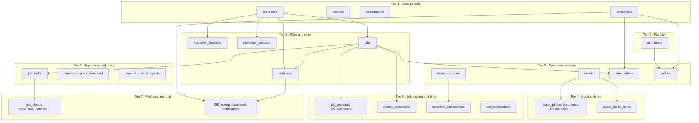

# SQL migration dependency audit

This document defines **table creation order** for the IPS APP Supabase schema so foreign keys succeed on fresh databases.

## IPS Operations unified migrations (recommended for new projects)

Run in Supabase SQL Editor **in this exact order**:

| Order | File | Contents |
|-------|------|----------|
| 1 | `001_core.sql` | customers, vendors, departments, employees, locations, profiles, company_settings, RLS helpers |
| 2 | `002_jobs.sql` | jobs, notes, daily updates, activity |
| 3 | `003_estimates.sql` | estimates, line items, labor lines, activity |
| 4 | `004_inventory.sql` | inventory_items, transactions |
| 5 | `005_assets.sql` | assets, maintenance, assignments |
| 6 | `006_timekeeping.sql` | time_entries, weekly/daily timekeeping, timesheets |
| 7 | `007_employees.sql` | certifications, employee documents, HR RLS |
| 8 | `008_documents.sql` | documents_hub |
| 9 | `009_tasks_updates.sql` | todos, company_updates, reads |
| 10 | `010_lookups.sql` | ips_lookup_tables/values + seed data |
| 11 | `011_phase3_schema_align.sql` | Optional additive columns + lookup seeds for Phase 3 services |

**Prerequisites:** Supabase Auth enabled (`auth.users` exists).

**Notes:**
- All files use UUID PKs, `created_at`, indexes, and basic RLS for `authenticated`.
- No secrets or API keys in SQL.
- Legacy migrations (`000_core_bootstrap.sql`, `062_phase3_operations_hub.sql`, etc.) remain for existing databases; do not double-run equivalent `CREATE TABLE` on a DB already built from `001`–`010`.

---

## Legacy quick start (existing databases)

Numeric filenames (`000`–`062`) reflect history, not safe dependency order.

1. Enable **Supabase Auth** (built-in `auth.users`).
2. Run **`000_core_bootstrap.sql`** — creates parent tables in your priority order.
3. Run remaining files in **Recommended run order** below (skip files marked **SKIP** on fresh installs).
4. Finish with **`062_phase3_operations_hub.sql`**.

## Your priority → tables

| Priority | Entity | Physical table(s) | Created by |
|----------|--------|-------------------|------------|
| 1 | employees | `employees` | `000` (then alters in `026`, `062`) |
| 2 | customers | `customers` | `000` (alters `017`) |
| 3 | vendors | `vendors` | **`000` only** — no other migration `CREATE TABLE` |
| 4 | departments | `departments` | **`000` only** — `062` seeds `ips_lookup_values` for dropdowns, not this table |
| 5 | locations | `customer_locations` | `000` / `024` (sites per customer) |
| 6 | jobs | `jobs` | `000` (alters `005`, `020`, `022`) |
| 7 | estimates | `estimates` | `000` (alters `021`, `058`) |
| 8 | inventory | `inventory_items` | `000` / `015` (txn in `027`) |
| 9 | assets | `assets` + children | `000` / `001` + kit migrations `037`–`044` |
| 10 | time_entries | `time_entries` | `000` / `009` / `010` (alters `026`, `027`) |
| 11 | child / link | see tier 11 below | `016+`, `047+`, `062` |

## Critical gaps (before this audit)

These tables are **referenced** by migrations but had **no `CREATE TABLE`** in `sql/`:

| Table | Referenced in | Fix |
|-------|---------------|-----|
| `customers` | `016`, `019`, `024`, `031`, … | `000_core_bootstrap.sql` |
| `jobs` | `004`, `009`, `010`, `019`, … | `000` |
| `estimates` | `019`, `024`, `062`, … | `000` |
| `vendors` | app + future PO | `000` |
| `departments` | org / HR | `000` |

`profiles` requires `auth.users` — included at end of `000` (also `033`).

## Duplicates and conflicts

| Issue | Files | Recommendation |
|-------|-------|----------------|
| **employees** defined twice | `008`, `010` | Use **`000`** on fresh DB. Run **`010`** for additive columns/indexes only. **Skip `008`** unless legacy `employee_time_entries` exists (that table is **not** created anywhere in `sql/`). |
| **time_entries** defined twice | `009`, `010` | Prefer **`000`** + **`010`** (idempotent alters). **`009`** is redundant if `000`/`010` ran. |
| **inventory_items** | `000`, `015` | Safe to run both (`IF NOT EXISTS`). |
| **assets** | `000`, `001` | Run **`001`** after `000` for full asset module columns + child tables. |
| **customer_locations** | `000`, `024` | Safe duplicate (`IF NOT EXISTS`). |
| **profiles** | `000`, `033` | Run **`033`** for auth triggers/policies; `000` only ensures table exists. |
| **Numeric order vs FKs** | `001` before `jobs` existed | `001` creates `assets.assigned_job_id` **without** FK — OK. `004` needs `jobs` — run **`000` before `004`**. |

## Dependency tiers (logical)

## Tier 11 — child / link tables (run after parents)

| Parent | Child / link tables | Migration file(s) |
|--------|---------------------|-------------------|
| `customers` | `customer_contacts`, `customer_locations` | `016`, `024`, `025` |
| `jobs` | `job_materials`, `job_equipment`, `weekly_timesheets`, `job_weekly_timesheets` | `023`, `004`, `031`, `032` |
| `jobs` | `job_tasks`, planning links, photos, packages | `047`–`057`, `061` |
| `employees` | `employee_toolbox_links`, certifications, documents, timekeeping | `013`, `014`, `062` |
| `assets` | `asset_*`, `asset_kits`, `tool_trailer_audits`, `tool_transactions` | `001`–`003`, `011`, `029`, `037`–`044` |
| `inventory_items` | `inventory_transactions`, `estimate_materials` | `027`–`030`, `039`, `040` |
| `estimates` | `estimate_materials`, `estimate_line_items` | `039`, `040`, `062` |
| `profiles` | `todos`, `company_updates`, email settings | `036`, `059`, `060`, `046` |
| `ips_lookup_tables` | `ips_lookup_values` | `062` |

## Recommended run order

Use this sequence in the Supabase SQL editor (or a migration runner). Files marked **SKIP** are optional on a **fresh** database after `000`.

| Step | File | Notes |
|------|------|-------|
| **0** | **`000_core_bootstrap.sql`** | **Required first** on new DB |
| 1 | `012_ips_shared_sequence.sql` | Standalone |
| 2 | `001_asset_module_tables.sql` | Asset children; `assets` from `000` |
| 3 | `002_asset_module_seed_rules.sql` | Seed |
| 4 | `003_asset_due_dates.sql` | Alter |
| 5 | `006_assets_rental.sql` | Alter |
| 6 | `007_migrate_equipment_catalog_to_assets.sql` | Data |
| 7 | `011_asset_documents_metadata.sql` | Alter |
| 8 | `017_customers_is_active.sql` | Alter |
| 9 | `016_customer_contacts.sql` | FK → `customers` |
| 10 | `018_customer_contacts_title_mobile.sql` | Alter |
| 11 | `024_customer_locations.sql` | FK → `customers` (noop if `000` ran) |
| 12 | `025_customer_contacts_location.sql` | FK → `customer_locations` |
| 13 | `005_jobs_job_number.sql` | Alter |
| 14 | `020_jobs_created_at.sql` | Alter |
| 15 | `022_jobs_source_type.sql` | Alter |
| 16 | `021_estimate_prepared_by.sql` | Alter |
| 17 | `058_estimates_scope_narrative_columns.sql` | Alter |
| 18 | `023_job_costing_materials_equipment.sql` | FK → `jobs`, `inventory_items`, `assets` |
| 19 | `015_inventory_items.sql` | **SKIP** if `000` ran |
| 20 | `034_inventory_qr_image_url.sql` | Alter |
| 21 | `035_inventory_image_url.sql` | Alter |
| 22 | `028_inventory_sku_txn_created_by.sql` | Alter |
| 23 | `027_inventory_qr_and_transactions.sql` | `inventory_transactions` |
| 24 | `030_inventory_txn_scan_audit.sql` | Alter |
| 25 | `039_estimate_materials.sql` | FK → `inventory_items` |
| 26 | `040_estimate_materials_inventory_ref_optional.sql` | Alter |
| **SKIP** | `008_employees.sql` | Legacy; needs `employee_time_entries` |
| **SKIP** | `009_time_entries.sql` | Redundant with `000`/`010` |
| 27 | `010_pm_matrix_time_tracking.sql` | Idempotent employee/time_entries |
| 28 | `026_time_entries_non_job_code.sql` | Alter |
| 29 | `027_time_entries_time_type.sql` | Alter (time_type column) |
| 30 | `026_employees_email.sql` | Alter |
| 31 | `004_weekly_timesheets.sql` | FK → `jobs` |
| 32 | `029_tool_checkout.sql` | FK → `assets`, `employees`, `jobs` |
| 33 | `037_asset_expenses.sql` | FK → `assets` |
| 34 | `038_asset_kit_items.sql` | FK → `assets`, `inventory_items` |
| 35 | `039_asset_kit_replacements.sql` | FK → `assets`, `asset_kit_items` |
| 36 | `040_asset_kits.sql` | FK → `assets` |
| 37 | `041_asset_kit_items_kits.sql` | Alter |
| 38 | `042_tool_trailer_audits.sql` | FK → `assets`, `asset_kit_items` |
| 39 | `044_kit_item_audit_logs.sql` | FK → `asset_kit_items` |
| 40 | `013_employee_toolbox_links.sql` | FK → `employees` |
| 41 | `014_employee_toolbox_resource_files.sql` | Storage refs |
| 42 | `033_profiles_auth.sql` | Auth + `profiles` policies |
| 43 | `043_auth_users_profiles_link_safe.sql` | Link users |
| 44 | `036_todos.sql` | FK → `profiles` |
| 45 | `059_todos_status_expand.sql` | Alter |
| 46 | `019_rls_authenticated_crud.sql` | RLS (needs core tables) |
| 47 | `031_job_weekly_timesheets.sql` | FK → `jobs`, `customers`, locations, contacts |
| 48 | `032_job_weekly_timesheets_token_expiry.sql` | Alter |
| 49 | `045_supervisor_daily_reports.sql` | FK → `jobs` |
| 50 | `047_supervisor_planning_goals.sql` | FK → `jobs` |
| 51 | `048_job_tasks_planning_links.sql` | FK → `jobs`, supervisor tables |
| 52 | `049_task_workflow.sql` | FK → `jobs`, `job_tasks` |
| 53 | `050_job_daily_work_plan_and_review_photo.sql` | FK → `jobs` |
| 54 | `051_job_task_photos.sql` | FK → `job_tasks`, `jobs` |
| 55 | `052_job_task_photos_capture_meta.sql` | Alter |
| 56 | `053_task_photos.sql` | FK → `job_tasks` |
| 57 | `054_work_plan_eod_and_task_order.sql` | Alter |
| 58 | `055_daily_work_packages_workflow.sql` | FK → `jobs`, `job_tasks` |
| 59 | `056_job_reference_attachments.sql` | FK → `jobs`, `job_tasks`, `profiles` |
| 60 | `057_job_tasks_merge_hazard_into_task_number.sql` | Alter |
| 61 | `046_email_notifications.sql` | FK → `jobs` |
| 62 | `060_company_updates.sql` | FK → `profiles` |
| 63 | `061_field_operations_phase1.sql` | FK → `jobs`, `job_tasks`, `employees` |
| 64 | **`062_phase3_operations_hub.sql`** | Lookups, documents, certifications, timekeeping |
| 65 | `113_job_cost_transactions.sql` | `job_cost_transactions`, `job_expenses`, employee burden fields |
| 66 | `114_job_cost_transactions_extend.sql` | Ledger asset/inventory links, description, created_by |

## Per-file CREATE TABLE index

| Table | First defined in |
|-------|------------------|
| `customers`, `vendors`, `departments`, `employees`, `customer_locations`, `jobs`, `estimates`, `inventory_items`, `assets`, `time_entries`, `profiles` | `000` |
| `asset_photos`, `asset_documents`, `asset_assignments`, `asset_maintenance`, `asset_inspections`, `asset_service_rules` | `001` |
| `weekly_timesheets`, `weekly_timesheet_lines` | `004` |
| `customer_contacts` | `016` |
| `job_materials`, `job_equipment` | `023` |
| `inventory_transactions` | `027` |
| `tool_transactions` | `029` |
| `job_weekly_timesheets` | `031` |
| `todos` | `036` |
| `asset_expenses` | `037` |
| `asset_kit_items` | `038` |
| `asset_kit_replacements` | `039` |
| `estimate_materials` | `039` |
| `asset_kits` | `040` |
| `tool_trailer_audits`, `tool_trailer_audit_items` | `042` |
| `kit_item_audit_logs` | `044` |
| `supervisor_daily_reports`, `supervisor_daily_report_crew`, `supervisor_daily_report_photos` | `045` |
| `job_email_settings`, `email_notifications` | `046` |
| `supervisor_goals`, `supervisor_tactical_plans`, `supervisor_plan_pm_reviews`, `supervisor_eod_reviews` | `047` |
| `job_tasks`, `supervisor_goal_tasks`, `supervisor_tactical_plan_tasks`, `supervisor_eod_task_results` | `048` |
| `supervisor_daily_task_plans`, `job_task_daily_reviews` | `049` |
| `job_daily_work_plans` | `050` |
| `job_task_photos`, `job_daily_review_progress_photos` | `051` |
| `task_photos` | `053` |
| `daily_work_packages`, `daily_work_package_tasks`, `supervisor_daily_execution`, `task_updates` | `055` |
| `job_reference_attachments` | `056` |
| `company_updates`, `company_update_reads` | `060` |
| `job_photos`, `job_checkins`, `crew_time_batches`, `crew_time_entries`, `job_timeline`, `notifications` | `061` |
| `ips_lookup_tables`, `ips_lookup_values`, `documents_hub`, `employee_certifications`, `estimate_line_items`, `employee_timekeeping_weeks`, `employee_timekeeping_days`, `employee_documents` | `062` |
| `ips_shared_sequence` | `012` |
| `employee_toolbox_links` | `013` |

## Legacy databases

If tables already exist in Supabase (created outside this repo):

- Run **`000`** anyway — all statements are `IF NOT EXISTS` / safe alters.
- Do **not** drop `employee_time_entries` if Job Costing still uses it; only run **`008`** when that table is present.
- Run **`010`** instead of **`009`** for time_entries hardening.
- Apply **`019`** RLS only after confirming policies do not conflict with production rules.

## Related docs

- [`SUPABASE_SCHEMA_NOTES.md`](../SUPABASE_SCHEMA_NOTES.md) — app column mapping
- [`DEPLOYMENT_NOTES.md`](../DEPLOYMENT_NOTES.md) — Streamlit deploy
